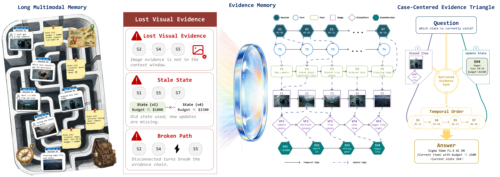

# From Long-Term Multimodal Histories to Reliable Evidence: Query-Conditioned Visual Verification and Constrained Selection

Official Repository of "From Long-Term Multimodal Histories to Reliable Evidence: Query-Conditioned Visual Verification and Constrained Selection".

<p align="center">
  
</p>

This repository contains the main experiment code for EviMem, an executable multimodal memory framework for long-term multimodal dialogue QA. EviMem preserves raw modality provenance, compiles query-conditioned evidence packets, reinspects original images when needed, and applies support-constrained answer selection.

Large assets are intentionally not included. Data and model paths are left empty in `configs/local_paths.example.env`; fill them locally before running.

## Setup

Create a Python environment:

```bash
conda create -n menevi python=3.10 -y
conda activate menevi
pip install -r requirements.txt
```

Install a CUDA-compatible PyTorch build for your machine if the default wheel is not suitable. The main experiments are designed for Linux bash scripts with CUDA GPUs.

## Data and Models

Download the MemLens benchmark from Hugging Face:

```bash
huggingface-cli download xiyuRenBill/MEMLENS \
  --repo-type dataset \
  --local-dir /path/to/memlens
```

Expected local data layout:

```text
/path/to/memlens/
├── dataset_32k.json
├── dataset_64k.json
├── dataset_128k.json
├── dataset_256k.json
├── agent_subset_195.json
├── release_images/
└── metadata/
```

Download the model weights separately:

```bash
huggingface-cli download Qwen/Qwen2.5-7B-Instruct --local-dir /path/to/Qwen2.5-7B-Instruct
huggingface-cli download Qwen/Qwen2.5-VL-7B-Instruct --local-dir /path/to/Qwen2.5-VL-7B-Instruct
```

Configure local paths:

```bash
cp configs/local_paths.example.env configs/local_paths.env
# edit configs/local_paths.env, then:
source configs/local_paths.env
```

Required variables:

```bash
export DATA_ROOT="/path/to/memlens"
export IMAGE_DIR="/path/to/memlens/release_images"
export TEXT_MODEL="/path/to/Qwen2.5-7B-Instruct"
export VISION_MODEL="/path/to/Qwen2.5-VL-7B-Instruct"
```

## Reproduction

1. Check the environment and downloaded files.

```bash
python memlens_repro/scripts/check_qwen25_env.py
python memlens_repro/scripts/check_memlens_layout.py \
  --repro-root memlens_repro \
  --qwen-llm-path "$TEXT_MODEL" \
  --qwen-vl-path "$VISION_MODEL"
```

2. Run EviMem on the 789-question MemLens benchmark at 32K/64K/128K/256K.

```bash
source configs/local_paths.env
LENGTHS="32k 64k 128k 256k" RUN_TAG=main bash scripts/run_evimem_length_curve.sh
```

3. Run matched strong baselines and compare them with the 32K EviMem system.

```bash
source configs/local_paths.env
RUN_TAG=main bash scripts/run_strong_baselines.sh
```

4. Run automatic routing and component ablations.

```bash
source configs/local_paths.env
RUN_TAG=main bash scripts/run_routing_analysis.sh
RUN_TAG=main bash scripts/run_component_ablations.sh
```

5. Profile efficiency and storage.

```bash
source configs/local_paths.env
PROFILE=1 RUN_TAG=profile bash scripts/run_efficiency_profile.sh
```

A convenience runner is also provided:

```bash
source configs/local_paths.env
bash scripts/run_all_main.sh
```

## Main Results

### Full 789-question MemLens results, eval_v2.1

| Method | Sub-EM (%) | Token F1 (%) |
|---|---:|---:|
| BM25 Text RAG | 33.71 | 38.93 |
| Caption RAG | 36.38 | 40.82 |
| Direct LVLM | 30.80 | 36.27 |
| Flat MM RAG (text) | 36.25 | 41.26 |
| Flat MM RAG (caption) | 36.38 | 41.46 |
| EviMem Full | 47.28 | 49.90 |

### Length curve on 789 questions

| Context | Typed Runtime Sub-EM | EviMem Full Sub-EM | Delta | Wins/Losses | McNemar p |
|---|---:|---:|---:|---:|---:|
| 32K | 43.85 | 47.28 | +3.42 | 42/15 | 0.000460 |
| 64K | 40.43 | 43.85 | +3.42 | 38/11 | 0.000142 |
| 128K | 40.05 | 42.33 | +2.28 | 32/14 | 0.011352 |
| 256K | 40.05 | 43.85 | +3.80 | 40/10 | 0.000024 |

The full result tables are in `results/`.

## Code Structure

```text
MenEvi/
├── README.md                              # Reproduction guide and result summary
├── requirements.txt                       # Python dependencies for the released code
├── configs/
│   └── local_paths.example.env            # Empty local path template for data and models
├── assets/
│   ├── introduction.png                   # README main figure rendered from the paper source
│   ├── introduction.pdf                   # Original paper figure source
│   └── method.pdf                         # Method figure source
├── scripts/
│   ├── run_evimem_length_curve.sh         # Public entrypoint for the main EviMem length-curve run
│   ├── run_strong_baselines.sh            # Public entrypoint for matched baseline runs
│   ├── run_routing_analysis.sh            # Public entrypoint for routing analysis
│   ├── run_component_ablations.sh         # Public entrypoint for component ablations
│   ├── run_efficiency_profile.sh          # Public entrypoint for profiling and storage summaries
│   └── run_all_main.sh                    # Public entrypoint for the main reproduction suite
├── common/       # Shared experiment runner utilities
│   ├── common.sh                          # Environment variables, asset preparation, reusable run steps
│   ├── scripts/
│   │   ├── assert_dataset.py              # Dataset cardinality checks
│   │   ├── build_caption_union.py         # Image-caption target collection across context lengths
│   │   ├── create_empty_visual_outputs.py # Empty visual output helper for no-target cases
│   │   ├── run_with_profile.py            # Wall-time and GPU-memory profiler wrapper
│   │   └── sanitize_full_packets.py       # Prompt and evidence packet sanitizer
│   └── tests/                             # Unit tests for shared helpers
├── answer_evidence/
│   ├── prompts/                           # Answer-focused evidence policies
│   └── scripts/                           # Evidence packet construction and deterministic scoring
├── visual_evidence/
│   ├── prompts/                           # Visual/OCR answer policy
│   └── scripts/                           # Visual evidence packet construction and answer execution
├── runtime_routing/
│   ├── prompts/                           # Specialist policies for temporal and arithmetic questions
│   └── scripts/                           # Runtime routing and specialist execution
├── typed_evidence/
│   ├── prompts/                           # Typed specialist policy
│   └── scripts/                           # Typed evidence compiler, visual inspection, eval_v2.1
├── holdout_validation/
│   ├── prompts/                           # Leakage-safe specialist policy
│   └── scripts/                           # Holdout split, leakage audit, and specialist validation utilities
├── reliability_gate/
│   └── scripts/                           # Reliability gate and frozen validation protocol
├── automatic_routing/
│   └── scripts/                           # Automatic routing evaluation
├── component_ablations/
│   └── scripts/                           # Graph/storage and gate component ablations
├── strong_baselines/
│   └── scripts/                           # BM25, caption, direct LVLM, and flat multimodal baselines
├── length_curve/
│   └── scripts/                           # Main length-curve summarization
├── efficiency_profile/
│   └── scripts/                           # Efficiency, storage, and profiling summaries
├── memlens_repro/
│   ├── scripts/                           # Local wrappers for MemLens preprocessing and baselines
│   └── MEMLENS/                           # Included MemLens evaluation code snapshot
└── results/                               # Lightweight paper-ready CSV/XLSX summaries
```